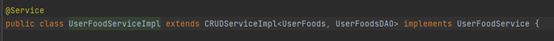
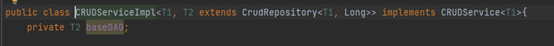
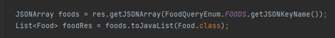
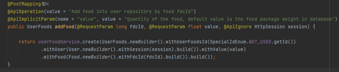
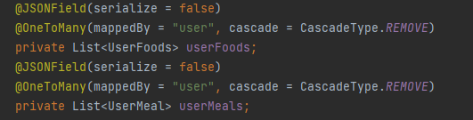
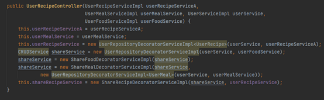
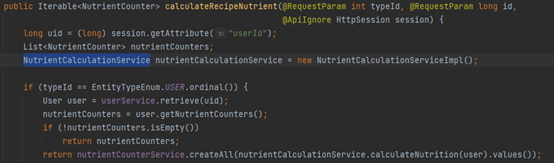
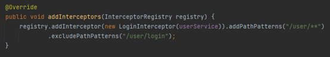
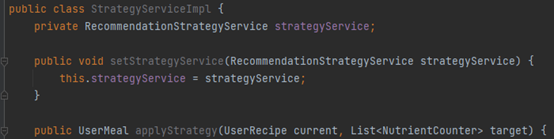

# Applied Design Patterns
## Bridge: Different DAO methods invoked by different CRUD services
  

## Adapter: Json objects convert into java entity objects
In FoodSearchServiceImpl class:  

## Singleton: Enum

## Builder: Entity builds object with any parameters
In UserFoodController class:  

## Composite: JPA entity contains subcomponents
In User class:  

## Factory: CRUD services (deprecated)
Decorator fits better with CRUD services.

## Decorator: User repository service and share repository services
In UserRecipeController class:  

## Facade: services hide complexity from controller
In NutrientCounterController class:  
Using NutrientCalculationService class to hide complexity  

## Chain of responsibility: login interceptor register in interceptor chain
In MvcConfig class:  

## Strategy: recommendation can apply different kinds of algorithms
  

## MVC: the whole project is designed with MVC design pattern